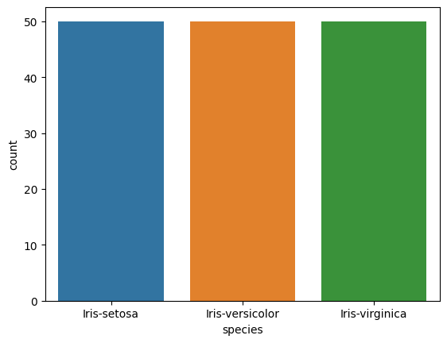
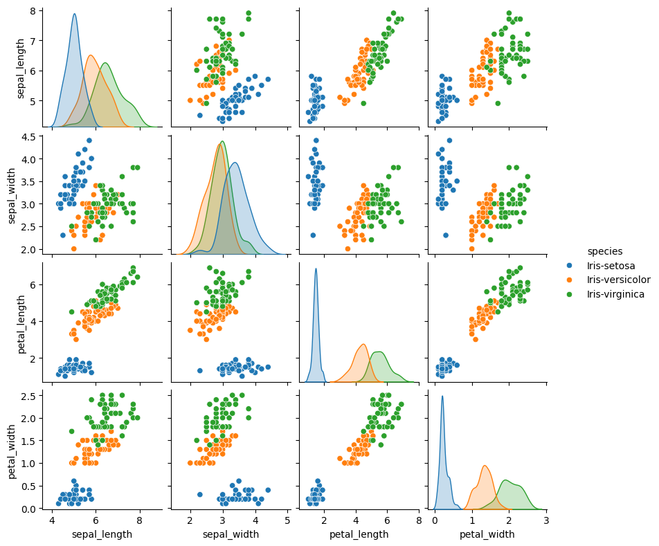
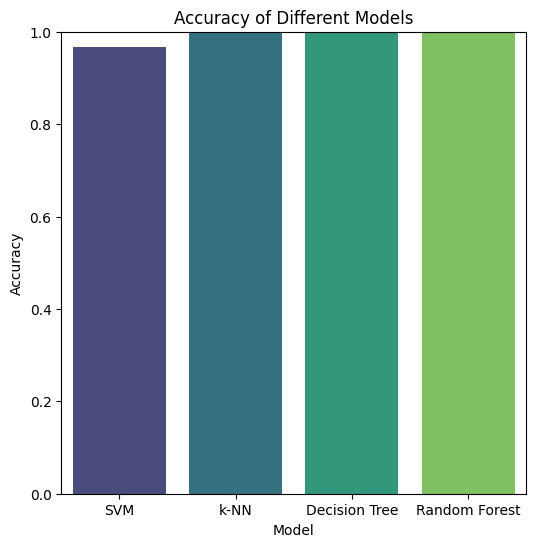
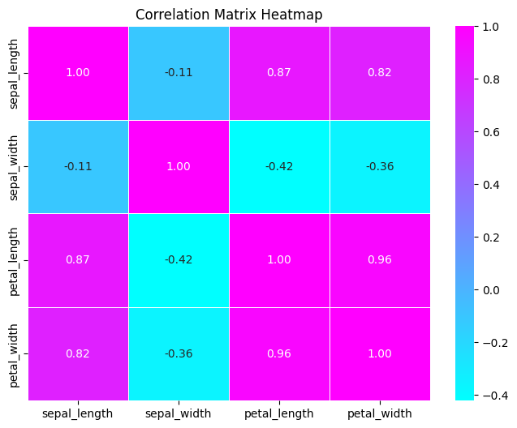

# Iris Flower Classification
This GitHub repository houses the code and resources for the Iris Flower Classification task. The project involves utilizing machine learning techniques to classify iris flowers into distinct species based on their sepal and petal measurements. 

### Overview
Machine learning plays a crucial role in various domains, from healthcare to finance and beyond. In this article, we’ll delve into a classic example of a machine-learning application: the Iris Flower Classification. We will explore the dataset, employ different machine-learning models, and discuss the insights gained from this fascinating project. This article contains code and resources for the Iris Flower Classification project. The objective of this project is to classify iris flowers into distinct species based on their sepal and petal measurements. The dataset used for training and evaluation is the well-known Iris dataset, consisting of samples from three iris species: Setosa, Versicolor, and Virginia.

### Data Exploration
Before diving into machine learning models, let’s explore the dataset. We load the data into a pandas data frame, perform basic statistical analysis, and visualize the distribution of features. The Seaborn library helps us create informative visualizations, such as count plots and pair plots, which offer insights into the relationships between different features. The Iris dataset includes features such as sepal length, sepal width, petal length, and petal width. The data is split into training and testing sets for model evaluation.

### Exploratory Data Analysis (EDA)
The dataset is explored using descriptive statistics and visualizations to understand the distribution and characteristics of the features.
NULL values are checked to ensure data integrity.

### Machine Learning Models:
We employ various machine learning models to classify the iris flowers based on their features. The models used include:

1. Support Vector Machine (SVM): Achieved an accuracy of 69.67%.
2. k-Nearest Neighbors (k-NN): Achieved an accuracy of 100%.
3. Decision Tree Classifier: Achieved an accuracy of 100%.
4. Random Forest Classifier: After hyperparameter tuning, achieved an accuracy of 100%.
These models are trained and evaluated on a testing set to measure their accuracy. The scikit-learn library simplifies the implementation of these models, making it accessible even for those new to machine learning.

### Accuracy of different Models

### Conclusion
In conclusion, the Iris Flower Classification project provides a hands-on exploration of machine learning techniques. Through data exploration, model training, and visualization, we gain a deeper understanding of the dataset and the capabilities of various classification models.

This project serves as an excellent starting point for those new to machine learning, offering practical insights into data preprocessing, model training, and performance evaluation. Feel free to explore the code, experiment with different models, and contribute to the project’s growth.

### How to Use the Code:
The code is available at [iris_flower_classification.py](iris_flower_classification.py). You can clone the repository, install the necessary dependencies, and run the provided script to experience the project firsthand.

By engaging with this project, you’ll not only enhance your understanding of machine learning but also contribute to a valuable resource for others exploring this fascinating field.

Happy coding!

